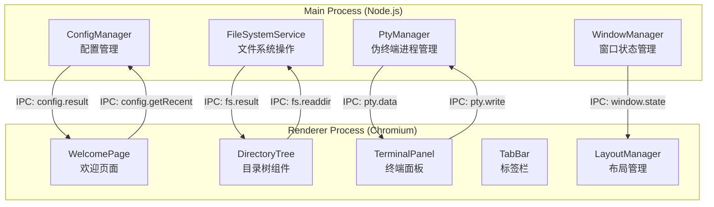
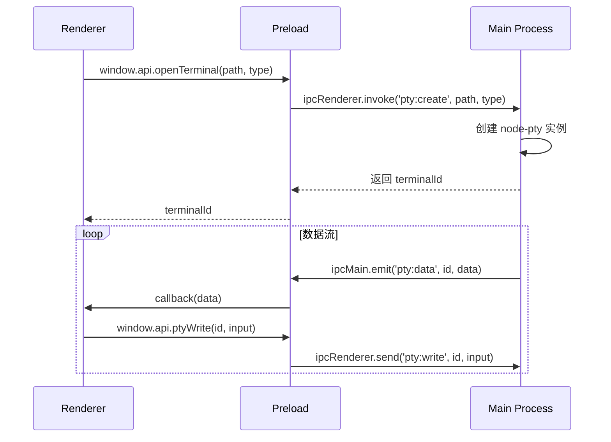

# 设计文档

## Overview

Foldim 是一个轻量级 Windows 桌面终端管理工具，采用 Electron + xterm.js + node-pty 技术栈构建。应用提供类似 VS Code 的启动体验，用户可通过欢迎页选择工作文件夹，在左侧目录树中浏览子文件夹结构，并通过双击文件夹在右侧面板中打开对应路径的内嵌终端会话。

### 核心技术选型

| 组件 | 技术 | 说明 |
|------|------|------|
| 桌面框架 | Electron | 跨平台桌面应用框架，提供 Node.js 和 Chromium 运行时 |
| 终端渲染 | @xterm/xterm + @xterm/addon-fit + @xterm/addon-webgl | Web 终端模拟器，支持 ANSI 256 色、WebGL 加速渲染 |
| 伪终端 | node-pty | Node.js 伪终端绑定，由 Microsoft 维护 |
| 打包工具 | electron-builder | 支持 portable zip 格式打包 |
| UI 框架 | 原生 HTML/CSS/JS（无重型框架） | 保持轻量，减少包体积 |

### 设计原则

1. **轻量优先**：不引入 React/Vue 等重型框架，使用原生 Web 技术构建 UI
2. **进程隔离**：主进程负责文件系统操作和 pty 管理，渲染进程负责 UI 展示
3. **Portable 友好**：所有配置存储在应用目录内，不依赖系统注册表或 AppData
4. **资源可控**：限制最大终端数量（20 个），防止资源耗尽

## Architecture

### 进程架构



### IPC 通信设计

主进程与渲染进程之间通过 Electron 的 `ipcMain` / `ipcRenderer` 进行通信，使用 `contextBridge` 暴露安全的 API：



## Components and Interfaces

### 1. Main Process 模块

#### PtyManager

负责管理所有 node-pty 伪终端实例的生命周期。

```typescript
interface PtyManager {
  // 创建新的伪终端实例
  create(options: PtyCreateOptions): Promise<string>; // 返回 terminalId
  // 向指定终端写入数据
  write(terminalId: string, data: string): void;
  // 调整终端尺寸
  resize(terminalId: string, cols: number, rows: number): void;
  // 销毁指定终端
  destroy(terminalId: string): Promise<void>;
  // 获取当前活跃终端数量
  getActiveCount(): number;
}

interface PtyCreateOptions {
  cwd: string;           // 工作目录
  shell: string;         // 终端可执行文件路径
  args?: string[];       // 启动参数
  env?: Record<string, string>; // 环境变量
}
```

#### FileSystemService

提供文件系统操作的封装，仅暴露必要的目录读取功能。

```typescript
interface FileSystemService {
  // 读取目录下的子文件夹列表
  readSubfolders(dirPath: string): Promise<FolderEntry[]>;
  // 检查路径是否存在且可访问
  checkAccess(dirPath: string): Promise<AccessCheckResult>;
  // 打开系统文件夹选择对话框
  openFolderDialog(): Promise<string | null>;
}

interface FolderEntry {
  name: string;          // 文件夹名称
  path: string;          // 绝对路径
  accessible: boolean;   // 是否可访问
  hasChildren: boolean;  // 是否有子文件夹（用于显示展开箭头）
}

interface AccessCheckResult {
  exists: boolean;
  readable: boolean;
  writable: boolean;
}
```

#### ConfigManager

管理应用配置的持久化存储，配置文件存储在应用目录下的 `config` 子文件夹中。

```typescript
interface ConfigManager {
  // 获取完整配置
  getConfig(): AppConfig;
  // 更新配置
  updateConfig(partial: Partial<AppConfig>): Promise<void>;
  // 添加最近打开的文件夹
  addRecentFolder(folderPath: string): Promise<void>;
  // 获取最近打开的文件夹列表
  getRecentFolders(): Promise<RecentFolder[]>;
}
```

#### WindowManager

管理窗口状态的保存和恢复。

```typescript
interface WindowManager {
  // 保存当前窗口状态
  saveState(): Promise<void>;
  // 恢复窗口状态
  restoreState(): WindowState;
  // 获取默认窗口状态
  getDefaultState(): WindowState;
}
```

### 2. Renderer Process 模块

#### WelcomePage

欢迎页面组件，提供打开文件夹和最近文件夹列表功能。

```typescript
interface WelcomePage {
  // 渲染欢迎页面
  render(): void;
  // 处理打开文件夹按钮点击
  handleOpenFolder(): Promise<void>;
  // 处理最近文件夹点击
  handleRecentFolderClick(folderPath: string): Promise<void>;
  // 刷新最近文件夹列表状态
  refreshRecentList(): Promise<void>;
}
```

#### DirectoryTree

目录树组件，展示文件夹层级结构。

```typescript
interface DirectoryTree {
  // 设置根目录并渲染
  setRoot(folderPath: string): Promise<void>;
  // 展开指定节点
  expandNode(nodePath: string): Promise<void>;
  // 折叠指定节点
  collapseNode(nodePath: string): void;
  // 注册双击事件回调
  onFolderDoubleClick(callback: (path: string) => void): void;
}
```

#### TerminalPanel

终端面板组件，管理 xterm.js 实例和标签页。

```typescript
interface TerminalPanel {
  // 创建新终端标签页
  createTab(options: TerminalTabOptions): Promise<string>;
  // 关闭指定标签页
  closeTab(tabId: string): Promise<void>;
  // 切换到指定标签页
  switchTab(tabId: string): void;
  // 获取当前标签页数量
  getTabCount(): number;
  // 显示/隐藏终端面板
  toggle(): void;
}

interface TerminalTabOptions {
  cwd: string;
  terminalType: TerminalType;
  title?: string;
}
```

#### LayoutManager

布局管理组件，处理分栏拖拽和面板显隐。

```typescript
interface LayoutManager {
  // 初始化布局
  init(config: LayoutConfig): void;
  // 设置分栏比例
  setSplitRatio(leftPercent: number): void;
  // 切换终端面板显隐
  toggleTerminalPanel(): void;
  // 保存当前布局状态
  saveLayout(): LayoutConfig;
}

interface LayoutConfig {
  splitRatio: number;      // 左侧面板宽度百分比 (15-85)
  terminalVisible: boolean;
}
```

### 3. Preload API（contextBridge 暴露）

```typescript
// 渲染进程可用的安全 API
interface ElectronAPI {
  // 文件系统
  openFolderDialog(): Promise<string | null>;
  readSubfolders(dirPath: string): Promise<FolderEntry[]>;
  checkAccess(dirPath: string): Promise<AccessCheckResult>;

  // 终端管理
  createTerminal(options: PtyCreateOptions): Promise<string>;
  writeTerminal(terminalId: string, data: string): void;
  resizeTerminal(terminalId: string, cols: number, rows: number): void;
  closeTerminal(terminalId: string): Promise<void>;
  onTerminalData(terminalId: string, callback: (data: string) => void): void;
  onTerminalExit(terminalId: string, callback: (code: number) => void): void;

  // 配置
  getConfig(): Promise<AppConfig>;
  updateConfig(partial: Partial<AppConfig>): Promise<void>;
  getRecentFolders(): Promise<RecentFolder[]>;
  addRecentFolder(path: string): Promise<void>;

  // 窗口
  getWindowState(): Promise<WindowState>;
  saveWindowState(state: WindowState): Promise<void>;
}
```

## Data Models

### AppConfig（应用配置）

```typescript
interface AppConfig {
  defaultTerminalType: TerminalType;  // 默认终端类型
  terminalPaths: TerminalPaths;       // 各终端类型的可执行文件路径
  recentFolders: RecentFolder[];      // 最近打开的文件夹列表
  windowState: WindowState;           // 窗口状态
  layoutConfig: LayoutConfig;         // 布局配置
}

type TerminalType = 'cmd' | 'powershell' | 'gitbash' | 'windowsTerminal';

interface TerminalPaths {
  cmd: string;            // 默认: 'cmd.exe'
  powershell: string;     // 默认: 'powershell.exe'
  gitbash: string;        // 默认: 自动检测或用户指定
  windowsTerminal: string; // 默认: 'wt.exe'
}

interface RecentFolder {
  path: string;           // 文件夹绝对路径
  name: string;           // 文件夹名称（显示用）
  lastOpened: number;     // 最后打开时间戳（毫秒）
}

interface WindowState {
  x: number;
  y: number;
  width: number;
  height: number;
  isMaximized: boolean;
}
```

### TerminalInstance（终端实例运行时数据）

```typescript
interface TerminalInstance {
  id: string;                    // 唯一标识符（UUID）
  cwd: string;                   // 工作目录
  terminalType: TerminalType;    // 终端类型
  pid: number;                   // 进程 PID
  status: TerminalStatus;        // 当前状态
  createdAt: number;             // 创建时间戳
  exitCode?: number;             // 退出码（进程结束后）
}

type TerminalStatus = 'running' | 'exited' | 'error';
```

### 配置文件存储格式

配置文件路径：`<app_dir>/config/settings.json`

```json
{
  "defaultTerminalType": "cmd",
  "terminalPaths": {
    "cmd": "cmd.exe",
    "powershell": "powershell.exe",
    "gitbash": "C:\\Program Files\\Git\\bin\\bash.exe",
    "windowsTerminal": "wt.exe"
  },
  "recentFolders": [
    {
      "path": "D:\\Projects\\my-app",
      "name": "my-app",
      "lastOpened": 1700000000000
    }
  ],
  "windowState": {
    "x": 100,
    "y": 100,
    "width": 1024,
    "height": 768,
    "isMaximized": false
  },
  "layoutConfig": {
    "splitRatio": 30,
    "terminalVisible": true
  }
}
```

### Git Bash 路径自动检测策略

按优先级依次检测以下路径：
1. `C:\Program Files\Git\bin\bash.exe`
2. `C:\Program Files (x86)\Git\bin\bash.exe`
3. 环境变量 `PATH` 中搜索 `bash.exe`
4. 注册表 `HKEY_LOCAL_MACHINE\SOFTWARE\GitForWindows` 的 `InstallPath` 值

## Correctness Properties

*属性（Property）是指在系统所有有效执行中都应保持为真的特征或行为——本质上是对系统应做什么的形式化陈述。属性是人类可读规格与机器可验证正确性保证之间的桥梁。*

### Property 1: 最近文件夹列表排序与截断

*对于任意*最近打开的文件夹列表（无论长度），显示结果应按 `lastOpened` 时间戳降序排列，且条目数量不超过 10 个。

**Validates: Requirements 1.5**

### Property 2: 有效文件夹设置 Workspace_Folder

*对于任意*有效且可读的文件夹路径（无论来源是文件夹选择对话框还是最近列表），选择后应用状态应正确转换为主工作界面，且 `Workspace_Folder` 被设置为该路径。

**Validates: Requirements 1.3, 1.6**

### Property 3: 不可访问路径禁用状态

*对于任意*不可访问的文件夹路径（不存在或权限不足），无论出现在最近列表还是目录树中，UI 应将其标记为禁用/不可操作状态（灰色显示、不可点击或不可展开）。

**Validates: Requirements 1.7, 2.6**

### Property 4: 路径存在性批量检查

*对于任意*最近文件夹列表，Welcome_Page 加载时应对每个路径执行存在性检查，检查结果应准确反映路径的实际存在状态。

**Validates: Requirements 1.9**

### Property 5: 目录树仅显示文件夹

*对于任意*目录内容（包含文件和文件夹的混合列表），Directory_Tree 的输出应仅包含文件夹类型的条目，不包含任何文件条目。

**Validates: Requirements 2.2**

### Property 6: 目录树排序规则

*对于任意*文件夹名称列表，Directory_Tree 的排序结果应满足不区分大小写的字典序，且英文字母字符排在中文字符之前。

**Validates: Requirements 2.5**

### Property 7: 展开/折叠往返

*对于任意*可展开的文件夹节点，执行展开操作后再执行折叠操作，Directory_Tree 应恢复到展开前的视觉状态（子节点隐藏）。

**Validates: Requirements 2.3, 2.4**

### Property 8: 叶节点无展开箭头

*对于任意*不包含子文件夹的目录节点，Directory_Tree 不应为其显示展开箭头，正确标识其为叶节点。

**Validates: Requirements 2.8**

### Property 9: 终端创建工作目录正确

*对于任意*有效的文件夹路径，通过双击在 Directory_Tree 中创建终端时，新终端实例的工作目录（cwd）应等于该文件夹的绝对路径。

**Validates: Requirements 3.1**

### Property 10: 终端数量上限不变量

*对于任意*序列的终端创建和关闭操作，系统中活跃的终端实例数量应始终不超过 20 个。

**Validates: Requirements 3.6**

### Property 11: 终端关闭释放资源

*对于任意*活跃的终端实例，执行关闭操作后，对应的 node-pty 进程应被终止（PID 不再存在），且终端实例从管理列表中移除。

**Validates: Requirements 3.8**

### Property 12: 异常退出码显示

*对于任意*非零退出码（1-255），终端进程以该退出码退出时，终端面板应显示包含该具体退出码数值的异常退出提示信息。

**Validates: Requirements 3.10**

### Property 13: 默认终端类型配置生效

*对于任意*有效的 TerminalType 配置值（cmd、powershell、gitbash、windowsTerminal），当设置为默认终端类型后，新创建的终端应使用该类型启动。

**Validates: Requirements 4.2**

### Property 14: 终端类型可用性标识

*对于任意*终端类型可用性状态组合（每种类型可用或不可用），终端类型选择菜单应正确标识每种类型的可用状态——可用类型可选择，不可用类型灰显。

**Validates: Requirements 4.3**

### Property 15: 无效终端路径错误处理

*对于任意*无效的可执行文件路径（不存在或不可执行），尝试使用该路径启动终端时应产生错误，且不创建终端实例。

**Validates: Requirements 4.5**

### Property 16: 配置持久化往返

*对于任意*有效的应用配置（包括默认终端类型、终端路径、窗口状态），执行保存后重新加载应得到与保存前相同的配置值。

**Validates: Requirements 4.7, 6.4**

### Property 17: 配置存储路径正确

*对于任意*配置保存操作，生成的配置文件应位于应用目录下的 `config` 子文件夹中，而非系统用户目录或 AppData 目录。

**Validates: Requirements 5.2**

### Property 18: 分隔条最小宽度约束

*对于任意*分隔条拖拽位置（0% 到 100%），最终生效的分栏比例应确保左右两侧面板宽度均不小于窗口总宽度的 15%（即比例被钳制在 15%-85% 范围内）。

**Validates: Requirements 6.2**

### Property 19: 超出屏幕范围回退默认值

*对于任意*超出当前屏幕可用范围的窗口状态配置（位置或大小），应用启动时应忽略该配置，以默认大小 1024×768 居中显示在主屏幕上。

**Validates: Requirements 6.5**

### Property 20: 面板切换往返

*对于任意*初始面板显示状态（显示或隐藏），执行两次 Ctrl+` 切换操作后，面板应恢复到初始状态，且分栏比例与初始一致。

**Validates: Requirements 6.6**

## Error Handling

### 错误分类与处理策略

| 错误类型 | 触发场景 | 处理方式 | 用户反馈 |
|----------|----------|----------|----------|
| 路径不存在 | 打开文件夹、展开目录树、创建终端 | 阻止操作 | Toast 提示"路径不存在" |
| 权限不足 | 读取目录、创建终端、写入配置 | 阻止操作 | Toast 提示具体权限问题 |
| 终端启动超时 | 创建终端超过 10 秒 | 终止启动进程 | 终端面板显示超时错误 |
| 终端异常退出 | node-pty 进程非正常退出 | 保留输出内容 | 显示退出码和重启按钮 |
| 配置读写失败 | 配置文件损坏或目录只读 | 使用默认配置 | Toast 提示配置问题 |
| I/O 错误 | 读取子文件夹列表失败 | 保留节点可重试状态 | 节点下方显示错误信息 |
| 终端数量上限 | 已有 20 个终端时创建新终端 | 拒绝创建 | Toast 提示已达上限 |

### 错误处理原则

1. **不崩溃原则**：任何错误都不应导致应用崩溃，使用 try-catch 包裹所有异步操作
2. **可恢复原则**：错误发生后用户应能重试操作（如重新展开目录、重新启动终端）
3. **信息明确原则**：错误提示应包含具体原因（如"文件夹 D:\xxx 不存在"而非"操作失败"）
4. **优雅降级原则**：配置损坏时使用默认配置，不阻止应用启动

### 主进程错误处理

```typescript
// 未捕获异常处理
process.on('uncaughtException', (error) => {
  logger.error('未捕获异常', error);
  // 尝试保存当前状态后优雅退出
});

// 未处理的 Promise 拒绝
process.on('unhandledRejection', (reason) => {
  logger.error('未处理的 Promise 拒绝', reason);
});
```

### 渲染进程错误处理

```typescript
// 全局错误边界
window.onerror = (message, source, lineno, colno, error) => {
  showErrorToast(`应用错误: ${message}`);
  logger.error('渲染进程错误', { message, source, lineno, error });
};
```

## Testing Strategy

### 测试框架选型

| 测试类型 | 框架 | 说明 |
|----------|------|------|
| 单元测试 | Vitest | 快速、兼容 ESM、支持 TypeScript |
| 属性测试 | fast-check | JavaScript/TypeScript 属性测试库 |
| 集成测试 | Electron Playwright | Electron 应用端到端测试 |
| 冒烟测试 | 自定义脚本 | 验证打包产物基本功能 |

### 双重测试策略

#### 单元测试（Example-based）

针对具体场景和边界条件：
- 欢迎页面初始渲染状态
- 取消文件夹选择对话框后状态不变
- 加载超时显示指示器（500ms 阈值）
- 终端正常退出（退出码 0）的提示信息
- 默认布局比例 30:70
- config 文件夹不存在时自动创建

#### 属性测试（Property-based）

使用 fast-check 库，每个属性测试最少运行 100 次迭代：

- **Feature: foldim, Property 1**: 最近文件夹列表排序与截断
- **Feature: foldim, Property 2**: 有效文件夹设置 Workspace_Folder
- **Feature: foldim, Property 5**: 目录树仅显示文件夹
- **Feature: foldim, Property 6**: 目录树排序规则
- **Feature: foldim, Property 10**: 终端数量上限不变量
- **Feature: foldim, Property 12**: 异常退出码显示
- **Feature: foldim, Property 16**: 配置持久化往返
- **Feature: foldim, Property 18**: 分隔条最小宽度约束
- **Feature: foldim, Property 19**: 超出屏幕范围回退默认值
- **Feature: foldim, Property 20**: 面板切换往返

#### 集成测试

- 终端创建和命令执行端到端流程
- Git Bash 路径自动检测
- IPC 通信正确性
- 文件夹选择对话框交互

#### 冒烟测试

- 打包产物解压后可启动
- 四种终端类型基本可用性
- Windows 10 普通用户权限运行
- 首次启动时间 < 10 秒
- 包体积 < 200MB

### 属性测试配置

```typescript
// vitest.config.ts 中的属性测试配置
import { defineConfig } from 'vitest/config';

export default defineConfig({
  test: {
    // fast-check 默认运行 100 次迭代
    // 可在各测试文件中通过 fc.assert(property, { numRuns: 100 }) 配置
  }
});
```

### 测试目录结构

```
tests/
├── unit/                    # 单元测试
│   ├── config-manager.test.ts
│   ├── directory-tree.test.ts
│   ├── pty-manager.test.ts
│   ├── layout-manager.test.ts
│   └── welcome-page.test.ts
├── property/                # 属性测试
│   ├── config-roundtrip.prop.ts
│   ├── directory-filter.prop.ts
│   ├── directory-sort.prop.ts
│   ├── layout-constraints.prop.ts
│   ├── recent-folders.prop.ts
│   └── terminal-management.prop.ts
├── integration/             # 集成测试
│   ├── terminal-e2e.test.ts
│   └── ipc-communication.test.ts
└── smoke/                   # 冒烟测试
    └── portable-launch.test.ts
```

